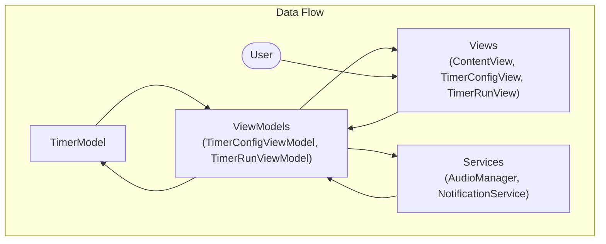

# System Patterns: PeakRush Timer

## Architecture Overview

PeakRush Timer follows the **MVVM (Model-View-ViewModel)** architecture pattern to separate concerns and maintain a clear separation between the UI and business logic:

## Component Structure

### Model Layer

- **TimerModel**: Central data structure that holds configuration parameters, computed properties for time calculations, and runtime state.
  - Simple value type (struct) with immutable properties
  - Contains workout configuration (minutes, seconds, sets)
  - Tracks runtime state (current set, phase, time remaining)
  - Provides computed properties for workout calculations

### ViewModel Layer

- **TimerConfigViewModel**: Manages the timer configuration interface and creates data for the run screen.

  - Provides bindings for SwiftUI controls
  - Validates configuration parameters
  - Creates the TimerRunViewModel when transitioning to the timer run screen

- **TimerRunViewModel**: Handles timer execution, background processing, and user interactions during a workout.
  - Manages the timer lifecycle (start, pause, stop)
  - Handles background execution when app is minimized
  - Controls audio notifications and visual feedback
  - Manages state transitions between intensity levels

### View Layer

- **ContentView**: Entry point that sets up the navigation stack
- **TimerConfigView**: Configuration interface with time, sets, and intensity selection
- **TimerRunView**: Workout execution interface with timer display and controls

### Services

- **AudioManager**: Handles sound playback and speech synthesis
  - Singleton pattern for global audio management
  - Prepares and plays notification sounds
  - Manages text-to-speech for announcements
- **NotificationService**: Manages local notifications for background execution
  - Schedules notifications for phase transitions
  - Sends completion notifications when workout finishes in background

## Key Design Patterns

1. **MVVM (Model-View-ViewModel)**

   - Clear separation between presentation and business logic
   - SwiftUI's `@Published` and `@ObservedObject` for data binding
   - ViewModels translate model data into view-ready formats

2. **Observer Pattern**

   - SwiftUI's reactive updates based on state changes
   - `@Published` properties trigger UI updates automatically

3. **Singleton Pattern**

   - AudioManager implemented as a shared instance for centralized audio control
   - Ensures consistent audio behavior across the application

4. **Dependency Injection**

   - ViewModels receive their dependencies through initializers
   - Improves testability and maintains separation of concerns

5. **State Management**
   - Explicit tracking of timer states (running, paused, completed)
   - State transitions trigger appropriate UI updates and background behaviors

## Data Flow

1. **Configuration Flow**

   - User inputs are captured via SwiftUI bindings in TimerConfigView
   - TimerConfigViewModel validates and processes these inputs
   - When "Let's Go" is tapped, TimerModel is created and passed to TimerRunViewModel

2. **Timer Execution Flow**

   - TimerRunViewModel manages a Timer object for second-by-second updates
   - Model state is updated on each tick
   - SwiftUI reactively updates the UI based on @Published property changes
   - Audio and visual cues are triggered based on timer state

3. **Background Execution Flow**
   - Scene phase changes trigger appropriate handling in TimerRunViewModel
   - When backgrounded, the app schedules local notifications
   - When foregrounded, the app adjusts the timer state based on elapsed time

## Cross-Cutting Concerns

1. **Background Processing**

   - UIBackgroundTaskIdentifier for extended execution time
   - Scheduled local notifications for user alerts when backgrounded
   - Time adjustment logic when returning to foreground

2. **Audio Management**

   - AVFoundation for sound playback and speech synthesis
   - Audio session configuration for background audio

3. **Thread Safety**
   - Main thread execution for UI updates
   - Background tasks for audio processing when needed
